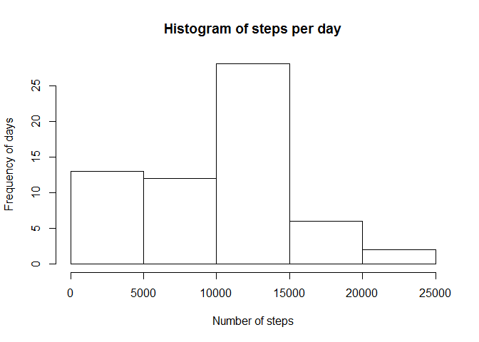
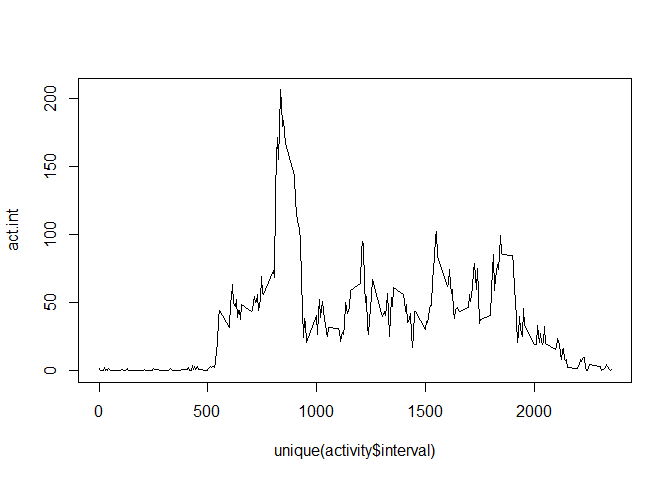
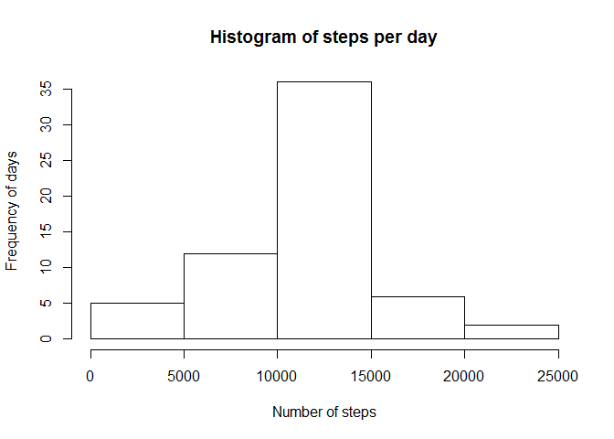
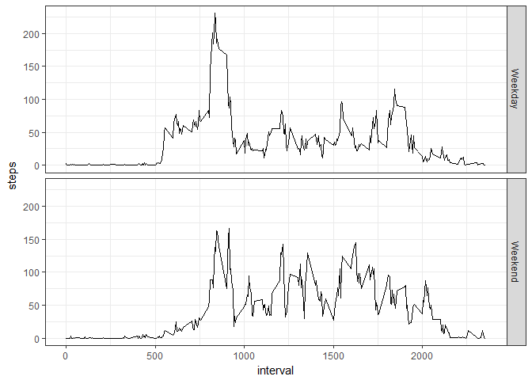

# Reproducible Research: Peer Assessment 1

## Loading and preprocessing the data

Unzip and load the data. Give date format.

```r
activity<-read.csv(unz("activity.zip","activity.csv"),header=TRUE)
activity$date<-as.Date(activity$date)
```

## What is mean total number of steps taken per day?

Calculate the sum of steps per day and save in "activity.day".

Plot a histogram

```r
activity.day<-tapply(activity$steps,activity$date, sum, na.rm=TRUE)

hist(activity.day, main="Histogram of steps per day", xlab = "Number of steps",
     ylab="Frequency of days")
```

<!-- -->

Calculate mean and median of the sum of steps per day.

```r
mean(activity.day)
```

```
## [1] 9354.23
```

```r
median(activity.day)
```

```
## [1] 10395
```

## What is the average daily activity pattern?

Calculate the mean of steps per interval and save in "act.int".
Plot the mean of steps by intervals using a line type plot.

```r
act.int<-tapply(activity$steps,activity$interval,mean, na.rm=TRUE)
plot(unique(activity$interval),act.int, type="l")
```

<!-- -->

Find the maximum value of mean steps per interval and return the interval name

```r
maximum<-act.int==max(act.int)
names(maximum[maximum==TRUE])
```

```
## [1] "835"
```

## Imputing missing values

Calculate the total number of NAs in the database

```r
sum(is.na(activity$steps))
```

```
## [1] 2304
```

Create a new dataframe "activity.new" and fill NA values with the interval mean

```r
activity.new<-activity

for(i in 1:length(activity.new$steps)) {
      if (is.na(activity.new$steps[i])==TRUE) {
            activity.new$steps[i] <- mean(activity.new$steps[activity.new$interval==activity.new$interval[i]], na.rm=T)
      }
      else next()
}
```

Calculate the sum of steps per day and save in "act.new.day".

Plot a histogram. This new histogram is not skewed as the first one we did.

```r
act.new.day<-tapply(activity.new$steps,activity.new$date, sum)
hist(act.new.day, main="Histogram of steps per day", xlab = "Number of steps",
     ylab="Frequency of days")
```

<!-- -->

Now, the mean and median have the same value.

```r
mean(act.new.day)
```

```
## [1] 10766.19
```

```r
median(act.new.day)
```

```
## [1] 10766.19
```

## Are there differences in activity patterns between weekdays and weekends?
Add a variable with the name of the day to activity.new.

Create a new variable "weekday" to be filled with "Weekend" or "Weekday".

```r
activity.new$day<-weekdays(activity.new$date)
activity.new$weekday<-character(length = 17568)
```

Perform a loop to fill the empty "weekday" variable.

```r
for (i in 1:length(activity.new$day)) {
      if (activity.new$day[i] == "Saturday" | activity.new$day[i] == "Sunday") {
            activity.new$weekday[i] <- "Weekend"
      }
      else {
            activity.new$weekday[i] <- "Weekday"
      }
}
```
Subset the weekend and weekday data.

Find mean number of steps per interval in both subsets.

```r
weekend<-subset(activity.new, weekday=="Weekend")
weekend.int<-tapply(weekend$steps,weekend$interval, mean)
weekend.int<-as.numeric(weekend.int)

weekday<-subset(activity.new, weekday=="Weekday")
weekday.int<-tapply(weekday$steps,weekday$interval, mean)
weekday.int<-as.numeric(weekday.int)
```
Concatenate the just found value of the two subsets in a new data frame "activity.weekday"

Giive the information of day type and interval

```r
activity.weekday<-data.frame(row.names = 1:576)
activity.weekday$steps<-c(weekend.int,weekday.int)
activity.weekday$day<-c(rep("Weekend",288),rep("Weekday",288))
activity.weekday$interval<-rep(unique(activity.new$interval),2)
```
Load ggplot2

```r
library(ggplot2)
```

```
## Warning: package 'ggplot2' was built under R version 3.2.5
```
Plot a time series plot comparing weekend vs weekday data

Note that during weekends he activity starts later during the day

```r
g<-ggplot(activity.weekday,aes(interval,steps))
g+geom_line()+theme_bw()+facet_grid(day~.)
```

<!-- -->
